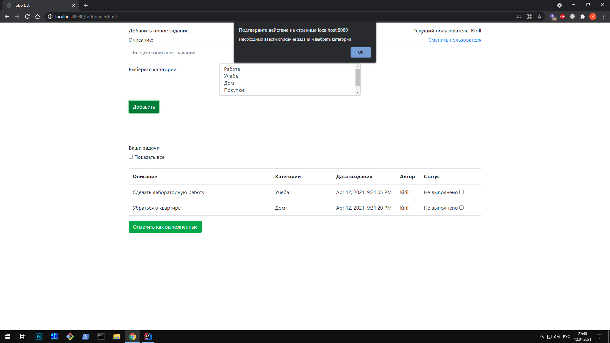

# job4j_todo
## Проект "TODO List"
## Используемые технологии

* Java servlets
* JavaScript (jQuery, Ajax), HTML
* Hibernate
* PostgreSQL
* Travis CI
* Maven

## Интрефейс приложения
### Основаня страница

### Необходимо ввести описание задачи

### Добавим новую задачу

### После добавления

### Необходимо выбрать задание, чтобы отметить его выполненным

### Отметим нужное нам задание

### Посмотрим все задания
