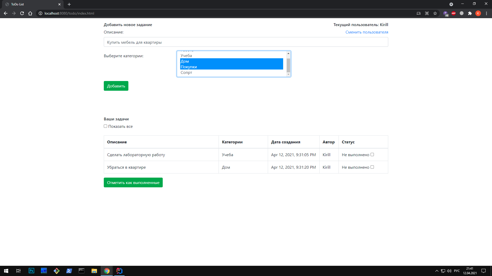
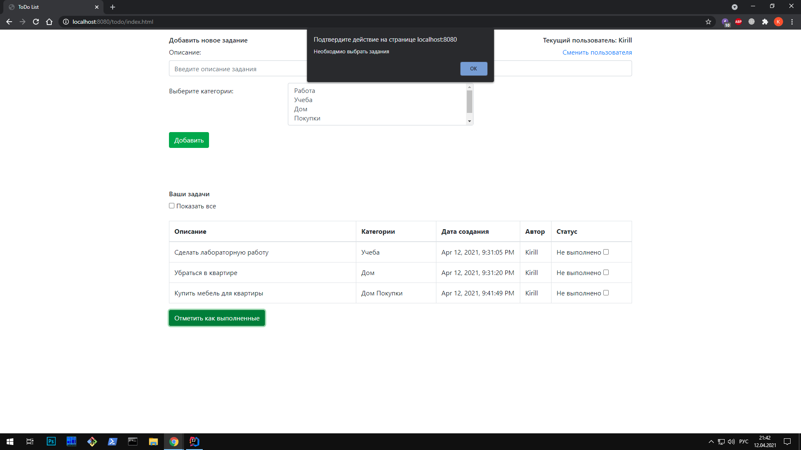
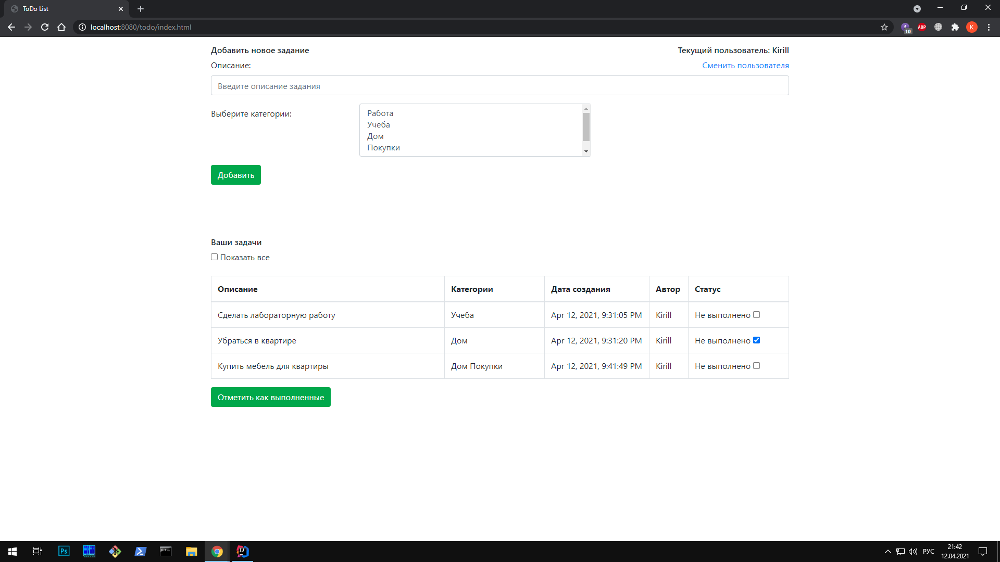

# job4j_todo
## Проект "TODO List"
## Используемые технологии

* Java servlets
* JavaScript (jQuery, Ajax), HTML
* Hibernate
* PostgreSQL
* Log4j, Sl4J
* Maven
* Apache Tomcat
* Travis CI, CheckStyle

## Интрефейс приложения
### Страница авторизации

### Необходимо ввести данные

### Необходимо ввести корректные данные

### Страница регистрации

### Необходимо ввести данные

### Необходимо ввести корректные данные 

### Основаня страница после логина

### Необходимо ввести описание задачи

### Добавим новую задачу

### После добавления

### Необходимо выбрать задание, чтобы отметить его выполненным

### Отметим нужное нам задание

### Посмотрим все задания

